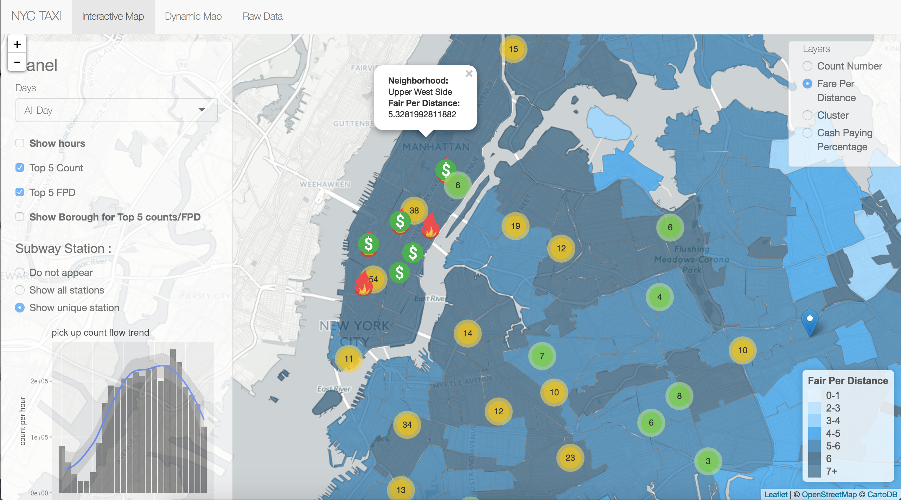

# Project 2: Open Data App - an RShiny app development project

### [Project Description](doc/project2_desc.md)



## Project Title: NYC TAXI
Term: Spring 2017

APP LINK: https://hz2412.shinyapps.io/nyc_taxi/

+ **NYC TAXI**:
	+ Dejian Wang
	+ Xuanyu Xiao
	+ He Zhu
	+ Hongyi Zhu
	

+ **Project summary**: In this project, we analyzed over 141 million records of yellow taxi rides in 2015 in New York City and compiled the data visually to help taxi driver answer some crucial questions such as, which are the busiest hours during the day in a neighborhood, or where can the drive expect to earn the highest amount of fare while traveling the shortest distance. Moreover, we color-coded both density of taxi rides and fare per distance, clustered by neighborhoods, grouped by whether the day is a business day, to provide visual representation of the massive amount of data that we have. In addition, we created a dynamic map to show how the pickup or dropoff change as time progresses during the day. Lastly, we provided a panel that allows user to peek into the kind of raw data that we worked with in the creation of this app. 

+ **Contribution statement**: ([default](doc/a_note_on_contributions.md)) All team members contributed equally in all stages of this project. All team members approve our work presented in this GitHub repository including this contributions statement. 

Following [suggestions](http://nicercode.github.io/blog/2013-04-05-projects/) by [RICH FITZJOHN](http://nicercode.github.io/about/#Team) (@richfitz). This folder is orgarnized as follows.

```
proj/
 app/
 lib/
 data/
 doc/
 output/
```

Please see each subfolder for a README file.

